# CommuMap Django Project - Complete Class Diagram

This Mermaid class diagram shows the complete structure of the CommuMap Django project including all models from the core, users, services, console, feedback, moderators, and managers apps.

```mermaid
classDiagram
    %% Core App Models
    class User {
        +UUID id
        +EmailField email
        +CharField role
        +CharField full_name
        +CharField phone
        +CharField service_name
        +EmailField official_email
        +CharField contact_number
        +TextField community_experience
        +CharField relevant_community
        +CharField organization
        +FloatField preferred_location_lat
        +FloatField preferred_location_lng
        +PositiveIntegerField search_radius_km
        +BooleanField is_verified
        +DateTimeField verification_requested_at
        +TextField verification_notes
        +DateTimeField created_at
        +DateTimeField updated_at
        +DateTimeField last_active
        +get_display_name()
        +request_verification()
        +verify_user()
        +reject_verification()
    }

    class SystemSettings {
        +BooleanField maintenance_mode
        +TextField system_announcement
        +BooleanField announcement_active
        +BooleanField registration_enabled
        +BooleanField service_submissions_enabled
        +BooleanField emergency_mode
        +FloatField default_map_center_lat
        +FloatField default_map_center_lng
        +PositiveIntegerField default_map_zoom
        +PositiveIntegerField emergency_search_radius_km
        +BooleanField auto_approve_services
        +BooleanField auto_approve_comments
        +get_instance()
    }

    class AuditLog {
        +UUID id
        +CharField action
        +TextField description
        +GenericIPAddressField ip_address
        +TextField user_agent
        +JSONField metadata
        +DateTimeField created_at
    }

    %% Users App Models
    class UserProfile {
        +FloatField preferred_location_lat
        +FloatField preferred_location_lng
        +PositiveIntegerField search_radius_km
        +BooleanField requires_wheelchair_access
        +BooleanField requires_sign_language
        +JSONField preferred_languages
        +BooleanField email_notifications
        +BooleanField emergency_alerts
        +BooleanField service_updates
        +BooleanField public_profile
        +BooleanField share_location
        +TextField bio
        +get_preferred_location_display()
        +get_accessibility_needs()
    }

    class ServiceBookmark {
        +UUID id
        +CharField folder_name
        +TextField notes
        +DateTimeField last_accessed
        +PositiveIntegerField access_count
        +mark_accessed()
    }

    class SearchHistory {
        +UUID id
        +CharField query
        +CharField search_location
        +FloatField search_radius_km
        +CharField category_filter
        +PositiveIntegerField results_count
        +CharField session_id
        +GenericIPAddressField ip_address
        +TextField user_agent
        +URLField referrer
    }

    class UserNotification {
        +UUID id
        +CharField notification_type
        +CharField title
        +TextField message
        +CharField priority
        +BooleanField is_read
        +DateTimeField read_at
        +URLField action_url
        +DateTimeField expires_at
        +mark_as_read()
        +is_expired()
    }

    class UserPreferences {
        +UUID id
        +CharField theme
        +CharField language
        +PositiveIntegerField default_map_zoom
        +BooleanField show_user_location
        +PositiveIntegerField default_search_radius_km
        +JSONField preferred_categories
        +BooleanField email_notifications
        +BooleanField sms_notifications
        +BooleanField emergency_alerts
        +BooleanField service_updates
        +BooleanField profile_public
        +BooleanField reviews_anonymous
        +BooleanField location_sharing
    }

    class UserActivity {
        +UUID id
        +CharField activity_type
        +JSONField metadata
        +CharField session_id
        +GenericIPAddressField ip_address
        +TextField user_agent
    }

    %% Services App Models
    class ServiceCategory {
        +UUID id
        +CharField name
        +SlugField slug
        +CharField category_type
        +TextField description
        +CharField icon
        +CharField color
        +BooleanField is_active
        +PositiveIntegerField sort_order
        +get_absolute_url()
    }

    class Service {
        +UUID id
        +CharField name
        +SlugField slug
        +TextField description
        +CharField short_description
        +JSONField tags
        +FloatField latitude
        +FloatField longitude
        +CharField address
        +CharField postal_code
        +CharField city
        +CharField state_province
        +CharField country
        +CharField phone
        +CharField phone_alt
        +EmailField email
        +URLField website
        +JSONField hours_of_operation
        +BooleanField is_24_7
        +TextField seasonal_info
        +PositiveIntegerField max_capacity
        +PositiveIntegerField current_capacity
        +DateTimeField capacity_last_updated
        +BooleanField is_emergency_service
        +BooleanField requires_appointment
        +BooleanField accepts_walk_ins
        +BooleanField is_free
        +TextField cost_info
        +TextField eligibility_criteria
        +TextField required_documents
        +CharField age_restrictions
        +BooleanField is_verified
        +DateTimeField verified_at
        +CharField current_status
        +BooleanField is_active
        +DecimalField quality_score
        +PositiveIntegerField total_ratings
        +TextField search_vector
        +get_absolute_url()
        +capacity_percentage()
        +is_near_capacity()
        +is_at_capacity()
        +display_capacity_status()
        +coordinates()
        +is_open_now()
        +distance_from()
        +update_capacity()
        +verify_service()
    }

    class RealTimeStatusUpdate {
        +UUID id
        +CharField change_type
        +CharField old_status
        +CharField new_status
        +PositiveIntegerField old_capacity
        +PositiveIntegerField new_capacity
        +TextField message
        +BooleanField notifications_sent
        +PositiveIntegerField notification_count
        +JSONField metadata
        +capacity_change_direction()
        +is_emergency_related()
        +mark_notifications_sent()
    }

    class ServiceAlert {
        +UUID id
        +CharField alert_type
        +CharField title
        +TextField message
        +BooleanField is_active
        +DateTimeField start_time
        +DateTimeField end_time
        +PositiveIntegerField priority
        +BooleanField show_on_map
        +BooleanField requires_acknowledgment
        +is_expired()
        +is_current()
        +priority_display()
        +expire_alert()
    }

    %% Feedback App Models
    class ServiceReview {
        +UUID id
        +PositiveIntegerField rating
        +CharField title
        +TextField content
        +JSONField tags
        +DateField visit_date
        +BooleanField is_verified
        +BooleanField is_anonymous
        +BooleanField is_flagged
        +DateTimeField approved_at
        +PositiveIntegerField helpful_count
        +PositiveIntegerField unhelpful_count
        +get_absolute_url()
        +helpful_ratio()
        +display_name()
    }

    class ServiceComment {
        +UUID id
        +TextField content
        +BooleanField is_approved
        +BooleanField is_flagged
        +BooleanField is_edited
        +DateTimeField approved_at
        +PositiveIntegerField like_count
        +get_absolute_url()
        +is_reply()
        +thread_level()
    }

    class ReviewHelpfulVote {
        +UUID id
        +BooleanField is_helpful
    }

    class CommentLike {
        +UUID id
    }

    class FlaggedContent {
        +UUID id
        +CharField reason
        +TextField description
        +BooleanField is_resolved
        +DateTimeField resolved_at
        +TextField resolution_notes
        +resolve_flag()
    }

    %% Moderators App Models
    class OutreachPost {
        +UUID id
        +CharField title
        +TextField content
        +URLField banner_image_url
        +BooleanField is_active
        +DateTimeField expires_at
        +PositiveIntegerField view_count
        +get_absolute_url()
        +is_expired()
        +is_visible()
        +increment_view_count()
    }

    class ModerationAction {
        +UUID id
        +CharField action_type
        +TextField reason
        +JSONField metadata
        +GenericIPAddressField ip_address
        +TextField user_agent
        +get_absolute_url()
        +target_display()
        +log_action()
    }

    class ModeratorNotification {
        +UUID id
        +CharField notification_type
        +CharField title
        +TextField message
        +CharField priority
        +BooleanField is_read
        +DateTimeField read_at
        +URLField action_url
        +DateTimeField expires_at
        +mark_as_read()
        +is_expired()
    }

    %% Managers App Models
    class ServiceAnalytics {
        +UUID id
        +DateField date
        +PositiveIntegerField total_visits
        +PositiveIntegerField unique_visitors
        +PositiveIntegerField total_bookmarks
        +PositiveIntegerField feedback_count
        +PositiveIntegerField comment_count
        +DecimalField average_rating
        +PositiveIntegerField rating_count
        +DecimalField average_capacity
        +PositiveIntegerField max_capacity_reached
        +JSONField peak_hours
    }

    class ManagerNotification {
        +UUID id
        +CharField notification_type
        +CharField title
        +TextField message
        +CharField priority
        +BooleanField is_read
        +DateTimeField read_at
        +URLField action_url
        +DateTimeField expires_at
        +mark_as_read()
        +is_expired()
    }

    class ServiceStatusHistory {
        +UUID id
        +CharField change_type
        +TextField old_value
        +TextField new_value
        +TextField description
        +GenericIPAddressField ip_address
        +TextField user_agent
    }

    %% Core Relationships - Fixed syntax with proper arrows and multiplicities
    User "1" -- "1" UserProfile : has
    User "1" -- "1" UserPreferences : has
    User "1" o-- "*" ServiceBookmark : creates
    User "1" o-- "*" SearchHistory : performs
    User "1" o-- "*" UserNotification : receives
    User "1" o-- "*" UserActivity : performs
    User "1" o-- "*" AuditLog : generates
    User "0..1" --> "0..*" User : verifies

    %% Service Relationships
    ServiceCategory "1" o-- "*" Service : categorizes
    User "0..1" o-- "*" Service : manages
    User "0..1" o-- "*" Service : verifies
    Service "1" o-- "*" ServiceBookmark : bookmarked_by
    Service "0..1" o-- "*" UserNotification : relates_to
    Service "0..1" o-- "*" UserActivity : involves
    Service "1" o-- "*" RealTimeStatusUpdate : updates
    Service "1" o-- "*" ServiceAlert : alerts_for
    Service "1" o-- "*" ServiceAnalytics : analyzed
    Service "1" o-- "*" ServiceStatusHistory : tracks

    %% Status and Alert Relationships
    User "0..1" o-- "*" RealTimeStatusUpdate : creates
    User "0..1" o-- "*" ServiceAlert : creates

    %% Feedback Relationships
    User "1" o-- "*" ServiceReview : writes
    User "1" o-- "*" ServiceComment : posts
    User "1" o-- "*" ReviewHelpfulVote : casts
    User "1" o-- "*" CommentLike : gives
    Service "1" o-- "*" ServiceReview : reviewed_by
    Service "1" o-- "*" ServiceComment : commented_on
    ServiceReview "1" o-- "*" ReviewHelpfulVote : voted_on
    ServiceComment "1" o-- "*" CommentLike : liked
    ServiceComment "0..1" o-- "*" ServiceComment : replies_to

    %% Flagging Relationships
    User "1" o-- "*" FlaggedContent : reports
    ServiceReview "0..1" o-- "*" FlaggedContent : flagged_review
    ServiceComment "0..1" o-- "*" FlaggedContent : flagged_comment

    %% Moderation Relationships
    User "1" o-- "*" OutreachPost : creates
    User "1" o-- "*" ModerationAction : performs
    User "1" o-- "*" ModeratorNotification : receives_mod
    ServiceCategory "1" o-- "*" OutreachPost : targets
    Service "0..1" o-- "*" ModerationAction : moderated_service
    ServiceComment "0..1" o-- "*" ModerationAction : moderated_comment
    OutreachPost "0..1" o-- "*" ModerationAction : moderated_post
    Service "0..1" o-- "*" ModeratorNotification : relates_to_mod

    %% Manager Relationships
    User "1" o-- "*" ManagerNotification : receives_mgr
    User "0..1" o-- "*" ServiceStatusHistory : creates_history
    Service "0..1" o-- "*" ManagerNotification : relates_to_mgr

    %% Review and Comment Approval Relationships
    User "0..1" o-- "*" ServiceReview : approved_reviews
    User "0..1" o-- "*" ServiceComment : approved_comments
```

## Model Organization by App

### Core App
- **User**: Main user model with role-based access control
- **SystemSettings**: Global system configuration (Singleton pattern)
- **AuditLog**: System action audit trail

### Users App
- **UserProfile**: Extended user profile with preferences
- **ServiceBookmark**: User's saved services
- **SearchHistory**: User search analytics
- **UserNotification**: User notification system
- **UserPreferences**: User UI and behavior preferences
- **UserActivity**: User activity tracking

### Services App
- **ServiceCategory**: Service categorization
- **Service**: Core service model with location and status
- **RealTimeStatusUpdate**: Real-time service status changes
- **ServiceAlert**: Service-specific alerts and announcements

### Console App
- **SystemAnnouncement**: System-wide announcements
- **MaintenanceTask**: System maintenance tracking
- **SystemMetrics**: System performance metrics
- **NotificationQueue**: Notification delivery queue

### Feedback App
- **ServiceReview**: User reviews with ratings
- **ServiceComment**: Threaded comment system
- **ReviewHelpfulVote**: Review helpfulness voting
- **CommentLike**: Comment liking system
- **FlaggedContent**: Content moderation flagging

### Moderators App
- **OutreachPost**: Community outreach posts
- **ModerationAction**: Moderation action audit trail
- **ModeratorNotification**: Moderator-specific notifications

### Managers App
- **ServiceAnalytics**: Service usage analytics
- **ManagerNotification**: Manager-specific notifications
- **ServiceStatusHistory**: Service status change history

## Key Features Represented

1. **Role-Based Access Control**: User model with different roles (USER, SERVICE_MANAGER, COMMUNITY_MODERATOR, ADMIN)
2. **Geographic Services**: Service location with lat/lng coordinates
3. **Real-Time Updates**: Status updates and capacity tracking
4. **Community Engagement**: Reviews, comments, and social features
5. **Content Moderation**: Flagging and moderation workflow
6. **Analytics**: Service analytics and system metrics
7. **Notification Systems**: Multiple notification types for different user roles
8. **Audit Trail**: Comprehensive logging of system actions 